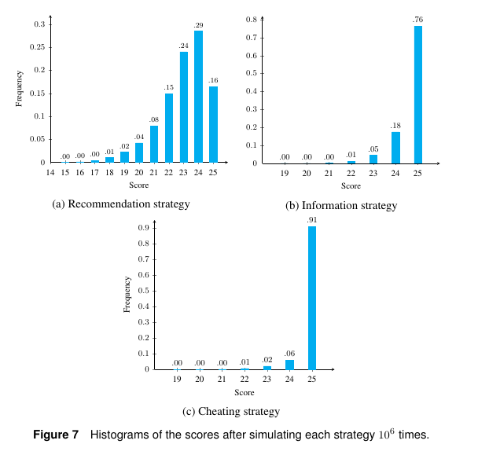

# IN104 - Rapport du projet Hanabi

Auteurs : [...]

Lien github de votre projet : https://github.com/
Si plusieurs branches seront à regarder, les indiquer toutes ; par défaut je n'irai que voir master.


Pour un exemple rapide de Markdown :
https://github.com/JDGaraudEnsta/misc#markdown
et le fichier source qui lui correspond :
https://raw.githubusercontent.com/JDGaraudEnsta/misc/master/README.md


Pour visualiser, vous pouvez l'uploader sur github, ou utiliser pandoc pour le convertir en html ou pdf :

    pandoc -s --toc README.md --css=./doc/github-pandoc.css -o README.html


## Stratégie retenue

Par exemple :
- nous avons tout d'abord choisi d'améliorer Cheater pour qu'elle soit aussi forte que celle de l'article ; il a fallu pour cela gérer [...]
- puis nous avons fait la stratégie Recommandation de l'article avec une variante consistant à [...].

## Points techniques

Vous avez certainement eu à faire plusieurs choix techniques pour implémenter le code.
Détaillez celui ou ceux qui vous semblent le plus pertinents, intéressants, où vous avez appris des trucs, où vous avez mis un effort important.

Par exemple : 
- dans deck.py, j'ai choisi de gérer le dernier tour de jeu à travers une liste `self.last_players`.
La technique est intéressante même si elle s'est avérée fragile lorsque un joueur `e(x)amine` le jeu.
- si vous voulez insérer un gros morceau de code, il suffit de mettre 3 back-ticks ``` et ça donne : 
```python
    def add_blue_coin(self):
        if self.blue_coins == 8:
            raise ValueError("Already 8 blue coins. Can't get an extra one.")
        self.blue_coins += 1

```


## Tests unitaires ou de non-régression

Présentez quelques (disons 2) tests unitaires.
Dans l'idéal, pour celles et ceux qui sont tombés sur un (gros) bug qui leur a pris du temps, il devrait y avoir un test unitaire qui protège contre sa réapparition.

Exemple :

- Le test `game_42.py` replace la partie dans une situation où l'AI est obligée de défausser une carte précieuse ; je veux garantir que c'est le 5 vert parce que celle celui qui fait perdre le moins de points.

- Le test `fin_de_partie.py` vérifie que les noms des joueurs sont les bons sur le dernier tour de jeu, parce que dans [telle situation...] ça n'avait pas été le cas.


## Tests en série - statistiques - analyse des résultats

C'est le morceau le plus important de ce rapport.

### AI Cheater

Le script `son_nom.py` lance l'AI 10000 fois.

Le score moyen obtenu est [...] ; pour comparaison le Cheater de l'article fait en moyenne 24.87.

Voici l'histogramme de nos résultats :


à comparer avec celui (c) de l'article :



Important : pensez à analyser et discuter les différences entre vos résultats et l'article.
En particulier, si vous faites mieux ou moins bien, quelles en sont les raisons, et des pistes d'amélioration.
Les parties qui finissent à moins de 25 points sont aussi intéressantes à analyser.


### AI Recommendation

Idem, expliquez ce que vous avez fait pour cette 2e AI.


## Conclusion et perspectives

Parce qu'il est toujours bon d'aider son lecteur à retenir les points importants,
et lui donner des nouvelles pistes de réflexion.
